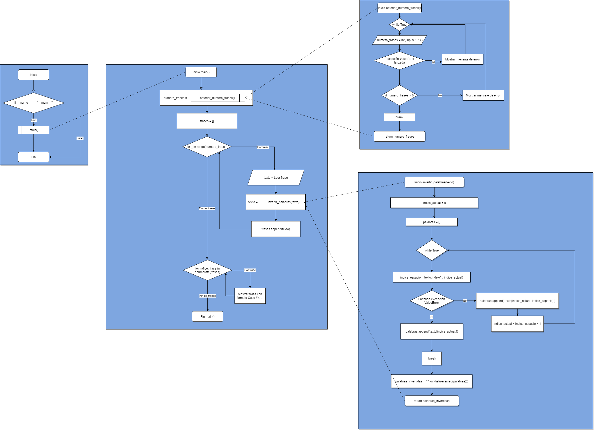

# Cómo ejecutar el código

-   Necesitamos [Python](https://www.python.org/) para poder ejectuar el código, aunque si no lo tenemos instalado sería recomendable instalar [anaconda](https://www.anaconda.com/products/individual) ya que incluye Python y es más flexible a la hora de añadir y modificar diferentes librerias o versiones para diferentes proyectos.

-   Ya que la tarea consta de tres ejercicios diferentes, cada uno de ellos se encuentra en su carpeta correspondiente (el_biologo, invertir_palabras y palindromo_primo).

-   Una vez instalado Python, abrir la consola o terminal, dirigirse al directorio donde se encuentra el archivo principal del proyecto (**el_biologo.py** en el caso de el_biologo, **invertir_palabras.py** en el caso de invertir_palabras y **palindromo_primo** en el caso de palindromo_primo) y introducir el comando **python nombre_archivo_principal.py** para ejecutar el programa correspondiente.

# Pasos seguidos para resolver la tarea

-   En todos los casos realicé el diagrama de flujo utilizando la página de [Flowchart Maker](https://app.diagrams.net/). Estos diagramas se muestran en este archivo .md dentro de la sección en la que se mencionan los pasos seguidos para resolver cada tarea, pero se puede hacer click derecho en el mismo y descargar o elegir la opción de abrir imagen en pestaña nueva para poder ver una versión ampliable.

# Pasos seguidos para resolver la sub-tarea El Biólogo

-   El programa de El Biólogo se divide en dos partes principales, por un lado obtener los input del usuario (las cadenas de las bases A, C, G ó T) y por otro encontrar la secuencia común más larga entre ambas. Se han extraido las funciones de esas partes a sus archivos correspondientes (**inputs_cadenas.py** para los inputs y **extraer_secuencias.py** para encontrar la secuencia común más larga).

-   Al pedir al usuario las cadenas que se analizarán, se convierten en mayúsculas y se comprueba que ningún caracter de la cadena sea diferente de A, C, G y T, ya que esos son los únicos caracteres que admitimos. Mientras no se cumpla esta condición, siempre se volverá a pedir al usuario que introduzca la cadena otra vez. Una vez el usuario haya introducido dos cadenas de bases correctas, podemos utilizar estas cadenas para encontrar su sub-cadena común más larga.

-   Al analizar las cadenas queremos encontrar el mayor número de caracteres continuos que sean iguales en ambas. Para comenzar decimos que la cadena que coincide es '', es decir una cadena vacía, con longitud cero. Se hacen dos bucles, por un lado empezando desde la primera base (o primer caracter) de la primera cadena y por cada base de la primera cadena lo comparamos a las bases de la segunda cadena. Si en algún momento encontramos dos bases que coinciden, hemos encontrado dos "sub-cadenas" que coinciden (aunque sólo sea de longitude de una base). Por lo tanto, a partir de esas posiciones en las cadenas contamos las bases siguientes que coinciden hasta encontrar una que sea diferente. Eso nos indica la longitud de la subcadena que coincide a partir de esa posición. Si la longitud calculada es más larga que la guardada anteriormente (que al inicio del programa es '' y longitud cero) se sobreescribe la cadena guardada. Este proceso continua hasta que hayamos recorrido completamente ambas cadenas, y de este modo al finalizar los bucles tendríamos la cadena más larga guardada.

-   Finalmente, mostramos el resultado de haber la función explicada en el punto anterior. Antes de mostrar la cadena más larga que coincide, comprobamos que la cadena no sea una cadena vacía ya que eso indicaría que no hay ningún tipo de secuencia que coincida y mostramos un mensaje correspondiente.

-   Este es el diagrama de flujo correspondiente al programa:

-   Para comprobar el correcto funcionamiento del programa, he utilizado estos inputs que se mostraban en el enunciado del ejercicio, añadiendo uno más en el que no hay una cadena que coincida.

    -   Entrada y salidas 1:

        -   Cadena 1: _ATGTCTTCCTCGA_
        -   Cadena 2: _TGCTTCCTATGAC_
        -   Salida esperada: _CTTCCT_

    -   Entrada y salidas 2:

        -   Cadena 1: _ctgactga_
        -   Cadena 2: _actgagc_
        -   Salida esperada: _ACTGA_

    -   Entrada y salidas 3:

        -   Cadena 1: _cgtaattgcgat_
        -   Cadena 2: _cgtacagtagc_
        -   Salida esperada: _CGTA_

    -   Entrada y salidas 4:
        -   Cadena 1: _CTA_
        -   Cadena 2: _GGG_
        -   Salida esperada: _No hay secuencia común entre ambas cadenas_

# Pasos seguidos para resolver la sub-tarea Invertir Palabras

-   El objetivo del programa es invertir un número determinado de cadenas de texto que el usuario indique. La definición de invertir en este caso concreto es en separar las "palabras" cuando se encuentra un caracter de espacio y mostrarlas en orden inverso. Por lo tanto este programa consta de dos partes (dividades en dos funciones). Por un lado, pedimos al usuario que indique el número de frases que quiere introducir (**obtener_numero_frases()**) después en un bucle (dentro de la función **main()**) pediremos las frases que ha indicado y llamaremos a la función **invertir_palabras()** para que nos devuelva la frase invertida. Finalmente, mostraremos el listado creado a partir de guardar las frases invertidasd con el formato **Case #x:** indicado en el enunciado. No se hace ningún tipo de validación de las frases introducidas por el usuario ya que estas pueden ser de cualquier tipo. Simplemente, si la frase no contiene un espacio, se muestra tal como fue introducida por el usuario.

-   La función auxiliar **obtener_numero_frases** se encarga de que el usuario haya introducido un valor correcto para indicar el número de frases que quiere invertir. Sólo acepta que se introduzca un número entero positivo mayor que cero. Una vez el usuario introduce un valor correcto, la función devuelve el valor.

-   La función auxiliar **invertir_palabras** Invierte el orden de las palabras de un texto que recibe. Para ello en un bucle inicial crea una lista de palabras, separando las partes del texto donde se encuentra un espacio. Una vez tenemos la lista, la invertimos utilizando la función reverse (que al no devolver una lista tenemos que una vez más convertir en una lista con list()) y unimos las palabras mediante espacios con el método .join().

-   Este es el diagrama de flujo correspondiente al programa:

-   Para comprobar el correcto funcionamiento del programa, he utilizado estos inputs que se mostraban en el enunciado del ejercicio.

    -   Entrada y salidas:

        -   Numero de frases: 3
        -   Frase 1: _this is a test_
        -   Frase 2: _foobar_
        -   Frase 3: _all your base_

        -   Salida esperada:

            **Case #1: test a is this**

            **Case #2: foobar**

            **Case #3: base your all**

# Pasos seguidos para resolver la sub-tarea Palíndromo Primo
