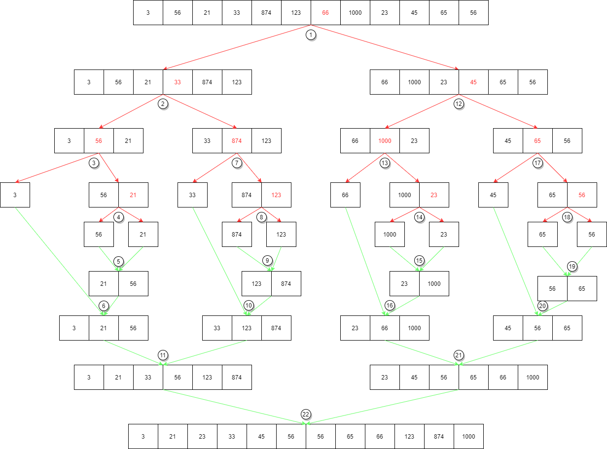
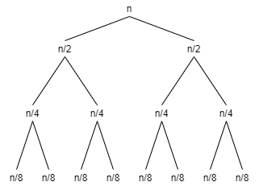

# Cómo ejecutar el código

-   Necesitamos [Python](https://www.python.org/) para poder ejectuar el código, aunque si no lo tenemos instalado sería recomendable instalar [anaconda](https://www.anaconda.com/products/individual) ya que incluye Python y es más flexible a la hora de añadir y modificar diferentes librerias o versiones para diferentes proyectos.

-   Una vez instalado abrir la consola o terminal, dirigirse al directorio donde se encuentra el archivo **secuencial_vs_binaria.py** y introducir el comando **python secuencial_vs_binaria.py** y el programa se ejecutará.

# Pasos seguidos para resolver la tarea

-   Creamos una lista, la ordenamos (utilizando el ordenamiento por mezcla) y después buscamos el número 875 en la misma lista que no incluye el número, tanto utilizando la búsqueda secuencial como la binaria.

-   El ordenamiento por mezcla es una función recursiva que divide la lista en dos mitades, se llama a sí misma sobre las dos mitades y finalmente mezcla cada mitad. El caso base de la función (el punto a partir del cual empieza a juntar todos los elementos que anteriormente ha divido pero ordenándolos) es cuando sólo hay un elemento restante en la lista. Por lo tanto la lista va a ser dividida en dos mitades continuamente hasta el punto en el que cada uno de los elementos se encuentra separado y a partir de entonces se empiezan a combinar los elementos para volver a formar la lista. Es en esta parte cuando el ordenamiento como tal sucede.

-   En el siguiente diagrama he puesto los pasos que sigue el algoritmo para ordenar la lista dada en el enunciado del ejercicio. Las operaciones de dividir la lista en dos mitades (ejecutado por la función **ordenamiento_por_mezcla** ) aparecen con flechas rojas mientras que las de unir y ordenar los elementos (ejecutado por la función **mezclar**) aparecen señalados con flechas verdes. Se ha añadido una numeración en cada una de las operaciones lo que muestra el orden concreto en el que se ejecutan.

-   La búsqueda secuencial recorre la lista elemento a elemento hasta que encuentra el item recibido. Antes de comprobar cada elemento se añade 1 a la variable de iteraciones, que se devolverá junto con el índice donde se encontró el item en la lista (o None en caso de que item no sea parte de la lista)

-   La búsqueda binaria mira el elemento central de una lista ordenada. Si el elemento encontrado es menor que el que se busca, significa que se encuentra en la mitad derecha, en caso contrario en la mitad izquierda. Tenemos dos variables (_bajo_ y _alto_) que nos indican el límite bajo y el límite alto de los elementos donde estamos buscando el elemento. Cada vez que comprobamos que el elemento central no sea el elemento que buscamos, modificamos el límite ya sea uno a la derecha o a la izquierda del elemento que hemos mirado. De este modo estamos continuamente descartando la mitad de los elementos. Si en algún momento el elemento comparado es el que buscamos, podemos devolver su índice (el que tenemos guardado como _centro_). En el caso de que el límite bajo sea superior al límite alto, sabemos que hemos descartado todos los elementos en la lista por lo que paramos de buscar (acabamos el bucle) y devolvemos un valor None como índice. También hemos añadido una variable _iteraciones_ al que se le añade 1 cada vez que comprobamos el elemento central de los restantes, y lo devolvemos en un tuplo junto con el índice encontrado.

-   Buscar un número no incluido en la lista nos costará el mayor número de iteraciones por ellas para llegar al resultado y las funciones de busqueda_secuencial y busqueda_binaria devolverán precisamente el número de iteraciones junto con el índice donde se encontró el elemento (o None en caso de no encontrarse) así como el número de iteraciones para llegar al resultado.

-   Finalmente mostramos los datos en consola.

# Análisis de la Notación O Grande

-   Comenzamos nuestro análisis de la notación O Grande desde el punto de partida de nuestro programa, la función _main_ en el archivo **secuencial_vs_binaria.py**. En primer lugar creamos una lista lo que supone un tiempo constante (por lo que tenemos O(1)).

-   Después procedemos a ordenar la lista utilizando el ordenamiento por mezcla. Como se ha descrito en la sección anterior, este algoritmo divide la lista en dos continuamente hasta acabar con listas de un solo elemento y a continuación las une ordenándolas. En el siguiente diagrama podemos ver cómo el número de operaciones será de **n** (el número de elementos, indicados en el diagrama por el número de columnas finales) múltiplicado por **log2n** (el número de filas en el diagrama, que es equivalente a dividir el número de elementos por la mitad hasta que sólo queden elementos únicos), múltiplicado todo a su vez por el número de operaciones que tenemos que hacer, siendo esto constante, por lo tanto en O Grande sería **1**.

-   Multiplicando estos factores vemos que la notación O Grande para el ordenamiento por mezcla es de **n\* log2n\*1**, que reducimos a **n\*log2n**.

-   Después mostramos el resultado de ordenar la lista y creamos una variable con el elemento a buscar. Una vez más estas operaciones son constantes por lo que añadirían O(1).

-   Pasamos a la búsqueda secuencial, que recorre todos y cada uno de los elementos de la lista, por lo que su coste es de O(n).

-   Como se ha explicado en la sección anterior, la búsqueda binaria divide los elementos en la mitad en cada iteración, por lo que su coste es de O(log2n).

-   Después mostramos los resultados de los cálculos en consola con varios comandos de print que una vez más son constantes respecto a el número de elementos por lo que añadimos O(1) una vez más.

-   Finalmente sumamos todos los costes, que son O(1) + O(n \* log2n) + O(1) + O(n) + O(log2n) + O(1), lo que podemos simplificar eliminando las operaciones constantes a O(n \* log2n + n + log2n). Quedándonos con el factor más grande vemos como el coste del programa es de **O(n\*log2n)**.
